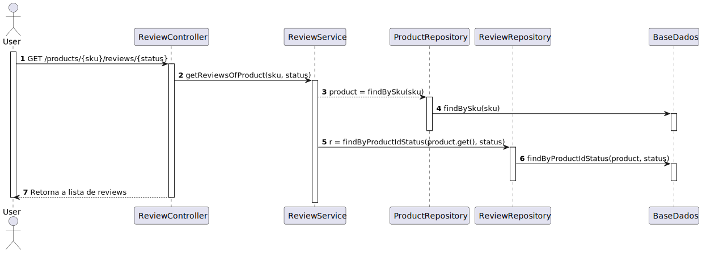

# README #

This README would normally document whatever steps are necessary to get your application up and running.

### What is this repository for? ###

* Quick summary
* Version
* [Learn Markdown](https://bitbucket.org/tutorials/markdowndemo)

### Documentação

## Criar Produto

Este Use Case permite ao utilizador criar um Produto, entidade que é necessária para
a criação das restantes entidades como Review e Voto. O produto é a base do projeto.

## Apagar Produto
Tal como referido no UseCase anterior, o produto é a base do projeto e é importante
demonstrar como este pode ser eliminado.

## Encontrar Produto

Este caso de uso permite aos usuários a capacidade de escolher um produto com base em seu código SKU. O SKU é um identificador único associado a cada produto em nosso sistema, e é fundamental para a rastreabilidade e organização de nosso catálogo. Essa funcionalidade é crucial para permitir que os usuários localizem rapidamente e com precisão os produtos desejados no sistema.

## Criar Review

Este caso de uso permite aos usuários registados criar Reviews para os produtos disponíveis na nossa plataforma. Para que uma review seja criada é necessário que o utilizador escolha um produto e de seguida atribua uma classificação ao mesmo.

## Obter Review

Este caso de uso permite aos utilizador encontrar uma lista de reviews pelo SKU do produto e pelo status da review. O SKU é um identificador único associado a cada produto no nosso sistema e o status da review pode ser approved, reject ou pending.
Desta forma, o utilizador procura as review especificas que prentende de um determinado produto.

## Apagar Review

Esta caso de uso concede aos usuários registados o controle sobre as reviews que eles criaram, permitindo-lhes excluir as suas reviews quando necessário, contribuindo para uma experiência mais personalizada e flexível na nossa plataforma.

## Adicionar Voto

Este caso de utilização permite ao utilizador adicionar votos a uma review existente, utilizando o identificador único dessa review. O votos podem ser upVotes ou downVotes.

## Login
Para algumas operações é necessária a autenticação de uma Role específica, para tal 
acontecer é necessário efetuar o login seguindos os passos representados no diagrama

## Criar Produto Sem o Sku

Este Use Case permite ao utilizador criar um Produto sem precisar de fornecer um SKU. O produto é uma entidade que é necessária para
a criação das restantes entidades como Review e Voto, sendo a base do projeto.

